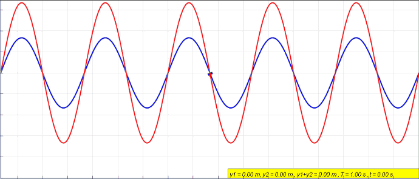

<!---->

### Quantum Algorithm
Recall that when we observe the qubits that are in a superposition state, it will immediately collapse into one of the possible states based on probability. Hence, we can only read a single state output from our quantum system. So then, how are we supposed to read the results form the collapsed state? 

The answer lies in the quantum algorithm $-$​ the instructions and operations that we have applied onto the quantum system. The algorithm is designed in a way such that all of the incorrect states (states representing the wrong answers) destructively interfere and "cancel" each other out. This leaves us with a high probability of observing the desired state (the state that represents the correct answer). 

<figure align="center">

<figcaption><i>The "cancelling" of superposition states are similar to destructive interference of waves</i></figcaption>
</figure>

 

Due to its randomness nature, quantum computation is inherently error prone. Hence, what we do is that we run the same algorithm multiple times, collect the results and tabulate them to obtain the correct answer with high confidence and low uncertainty. 

It should also be noted that quantum computers are often used to solve a class of problems known as NP-problems. The solutions to these problems can be easily verified using classical computers in polynomial time. However, the time required to find these solutions will be exponential, which will take millions of years for a classical computer to solve, but only a few minutes for quantum computers. Since they are easily verifiable, we can check with certainty if the solution we obtain from the quantum computer is correct. For example integer factorization is a NP-problem. Checking if some numbers are a factor of a number is easy: we just need to multiply them. However, finding the factors for a number is generally *very* difficult. Therefore, we can use a quantum computer to find the factors of the number, and use a classical computer to quickly validate if our answer is correct.