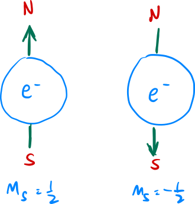

<!---->

# Quantum Computing

# Introduction
A quantum computer solves computational problems by exploiting the properties of quantum mechanics. The main goal of quantum computers is to demonstrate quantum supremacy where quantum computers are able to perform tasks that classical computers would need to take millions of years to compute in under a few minutes.

Quantum computing harnesses the phenomena of quantum mechanics to deliver a huge leap forward in computation to solve certain problems. In particular, it relies on physical phenomena such as quantum entanglement, interference and superposition. In other words, we are trying to use the universe itself to run compute results that we are interested in.

Beyond this part of the guide, you will need some basic understanding on superposition and quantum entanglement, which are explained [here](https://octo-kumo.github.io/physics-project/cat).

<figure align="center">

</figure>

 
 

# How Does it Work?
### The Qubit

In quantum computers, we have these things called *qubits* which are analogous to the bits in a classical computer, but with a twist $-$ unlike ordinary bits which can only be in two states (1 or 0), a qubit can be in a superposition of both states. 

In ordinary computers, a bit is usually stored in a transistor where a high voltage (*eg. 5V*) represents a $1$ state and a low voltage (*eg. 0V*) represents a $0$ state. On the other hand, the state of $1$ and $0$ in a quantum computer is usually represented as some property of a particle that exhibits quantum properties such as the spin $m_s$ of an electron where $\frac{1}{2}$ and $-\frac{1}{2}$ corresponds to the $1$ and $0$ state respectively.

<figure align="center">

</figure>

 
