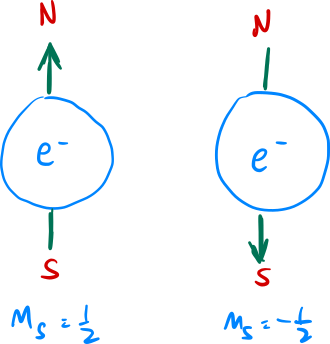

<!---->

# How Does it Work?
### The Qubit

In quantum computers, we have these things called *qubits* which are analogous to the bits in a classical computer, but with a twist $-$ unlike ordinary bits which can only be in two states (1 or 0), a qubit can be in a superposition of both states. 

In ordinary computers, a bit is usually stored in a transistor where a high voltage (*eg. 5V*) represents a $1$ state and a low voltage (*eg. 0V*) represents a $0$ state. On the other hand, the state of $1$ and $0$ in a quantum computer is usually represented as some property of a particle that exhibits quantum properties such as the spin $m_s$ of an electron where $\frac{1}{2}$ (up state) and $-\frac{1}{2}$ (down state) corresponds to the $1$ and $0$ state respectively.

<figure align="center">

</figure>

 