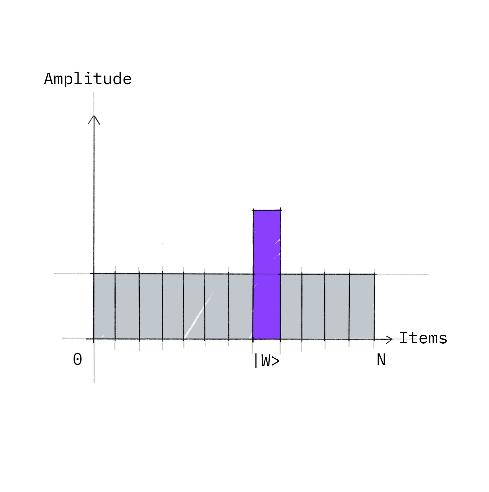

<efe></efe>

 
 

# Applications Of Quantum Computer

### Grover's Algorithm

Problem: Were trying to check if an item is present in a list. Given that the items are randomly arranged in the list, we have no choice but to do a brute force and check every item in the list to see if it is the desired item. On a classical computer, this will take $\frac{N}{2}$ searches on average where $N$ is the number of items in the list.

We can use Grover's algorithm to solve the problem in about $\sqrt{N}$ searches. To put things in perspective, if we have two billions of items to be searched, our classical computer will need to search through a billion of them on average while Grover's Algorithm will only need to perform number of operations in the order of magnitude of ten thousands $-$ significantly faster than using a classical computer.

 
 

<figure align="center">

<figcaption><i>Grover's algorithm increases the amplitude of the state corresponding to the answer. Recall that probability is the square of amplitude. Hence, the probability is increased too.</i></figcaption>

</figure>

 
 

To put it very briefly, each possible state of the qubits such as `0010` will correspond to an item in the list. The algorithm creates a uniform superposition over all possibilities and repeatedly destructively interferes states that are not solutions. As a result, there is a high probability ($\ge 0.5$) that the state we observe when the superposition collapses is the state corresponding to the item we are searching for.

References:

https://en.wikipedia.org/wiki/Timeline_of_quantum_computing_and_communication

https://qiskit.org/textbook/preface.html

https://www.ibm.com/topics/quantum-computing

https://www.youtube.com/playlist?list=PL50XnIfJxPDWDyea8EbbLe8GHfXkWU7W_

http://hyperphysics.phy-astr.gsu.edu/hbase/spin.html	

https://qiskit.org/documentation/qc_intro.html

https://en.wikipedia.org/wiki/Grover%27s_algorithm#Problem_description

https://medium.com/swlh/making-a-quantum-computer-at-home-bc59afe72d7d

http://twistedoakstudios.com/blog/Post2644_grovers-quantum-search-algorithm	
